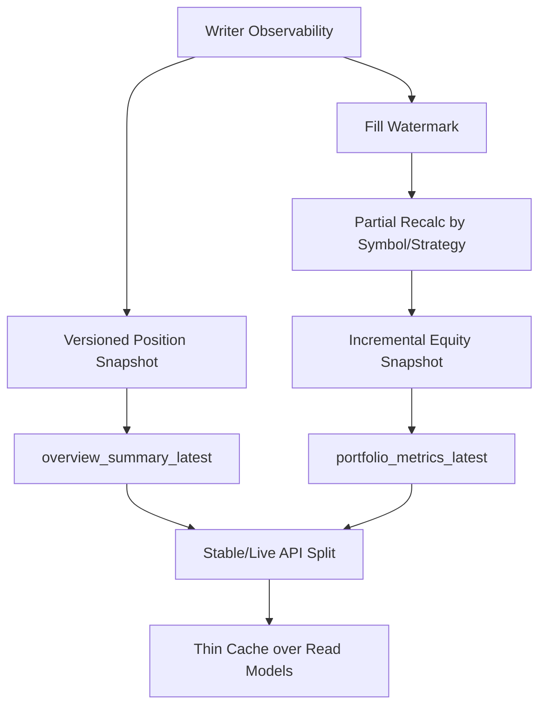

# Timeout Improvement Roadmap

## Goal

Reduce remaining timeout waves in Overview, Portfolio, and Execution by moving from ad-hoc read-path protection to:

- observable writer cost
- incremental writer updates
- stable read models
- explicit stable/live API contracts

This roadmap assumes the current low-risk read-path improvements are already in place:

- stale-first for selected QuantOps endpoints
- short TTL caches on selected V12 summary endpoints
- summary/detail endpoint separation for several GUI paths

## Current Diagnosis

Timeouts are driven by three layers:

1. Heavy read paths
2. Heavy writer behavior
3. Read/write contention on the same DB file

The highest-risk patterns today are:

- full scan of `execution_fills`
- delete/rebuild of `position_snapshots_latest`
- synchronous fallback recompute on cache miss
- mixing stable summary values and fresh event data without an explicit contract

## Design Direction

The target architecture is:

- truth ledger remains authoritative
- writer becomes incremental
- API reads move to read models
- UI displays stable summary and live feed separately

## Sprint Plan

### Sprint 1

Objective: make the current system observable and remove the most dangerous snapshot rebuild pattern.

#### Deliverables

- writer observability
- read freshness metadata
- versioned replacement for `position_snapshots_latest`

#### Tasks

- Replace `position_snapshots_latest` delete/rebuild with versioned snapshots
- Add writer observability for cycle cost and rebuild metrics
- Add read freshness metadata to summary endpoints
- Document freshness contracts for `stable`, `stale-allowed`, and `live`

#### Acceptance Criteria

- Writer cost per cycle is visible in logs/metrics
- Timeout cases can be classified as stale serve, build in progress, or writer pressure
- Readers never observe empty or partially rebuilt latest position state

### Sprint 2

Objective: move writer work from `O(total)` toward `O(delta)`.

#### Deliverables

- fill watermark
- partial position recompute by affected symbol/strategy
- incremental equity snapshot update

#### Tasks

- Add fill watermark state such as `last_processed_fill_id`
- Process only new fills after the watermark
- Recalculate positions only for affected `symbol` / `strategy_id`
- Make equity snapshot updates incremental
- Reduce history cost by separating recent/high-resolution and compacted history

#### Acceptance Criteria

- Normal writer cycles no longer perform full fill scans
- Writer duration scales with delta volume rather than total data size
- Execution quality and equity-history endpoints show fewer heavy latency spikes

### Sprint 3

Objective: move the main GUI endpoints to stable read models and explicit stable/live contracts.

#### Deliverables

- `overview_summary_latest`
- `portfolio_metrics_latest`
- stable/live API separation for Overview, Portfolio, Execution
- thin cache layer in front of read models only

#### Tasks

- Introduce `overview_summary_latest` read model
- Introduce `portfolio_metrics_latest` read model
- Optionally add `execution_state_latest` / `execution_quality_latest` read models
- Split API outputs into stable summary and live feed responsibilities
- Restrict stale-first cache to thin response optimization over read models

#### Acceptance Criteria

- Overview, Portfolio, and Execution major paths serve from read models
- Heavy truth-table fallback is removed from the main request path
- UI can explain any stable/live mismatch via explicit fields or explicit endpoint separation

## Prioritized Issue Backlog

### P0

1. Replace `position_snapshots_latest` delete/rebuild with versioned snapshots
2. Add writer observability for cycle cost and rebuild metrics
3. Add fill watermark and delta-based writer processing
4. Recalculate positions by affected `symbol` / `strategy_id` only
5. Introduce `overview_summary_latest` read model

### P1

1. Add read freshness metadata to summary endpoints
2. Make equity snapshot updates incremental
3. Introduce `portfolio_metrics_latest` read model
4. Split stable summary and live feed for Overview / Portfolio / Execution
5. Limit caches to thin response optimization over read models

## Issue Templates

### Replace `position_snapshots_latest` delete/rebuild with versioned snapshots

Current writer behavior deletes and rebuilds the latest position table, which exposes readers to contention and intermediate state. Replace it with a versioned build-and-switch model.

Acceptance:

- build version is created separately
- active version switches only after build completion
- readers do not see partial or empty latest state

### Add writer observability for cycle cost and rebuild metrics

Add metrics/logging for:

- `cycle_duration_ms`
- `fills_scanned`
- `fills_applied`
- `affected_symbols`
- `affected_strategies`
- `rebuild_rows`
- snapshot build duration

Acceptance:

- each writer cycle exposes measurable cost
- timeout analysis can attribute pressure to writer behavior

### Add read freshness metadata to summary endpoints

Add fields such as:

- `source_snapshot_time`
- `source_fill_watermark`
- `rebuilt_at`
- `data_freshness_sec`
- `build_status`

Acceptance:

- summary APIs expose freshness explicitly
- stale and rebuilding states are distinguishable

### Add fill watermark and delta-based writer processing

Introduce persistent fill watermark state and process only new fills after the checkpoint.

Acceptance:

- full fill scan removed from normal cycles
- watermark persists across restarts

### Recalculate positions by affected symbol/strategy only

Update only the affected position slices when new fills arrive.

Acceptance:

- changed rows only are updated
- recalculation scope matches affected fills

### Make equity snapshot updates incremental

Move equity calculation away from full historical replay and toward delta-based updates.

Acceptance:

- no full fill scan in normal equity update path
- equity, pnl, and exposure remain consistent

### Introduce `overview_summary_latest` read model

Add a stable summary table/model for Overview and move the main endpoint to this source.

Acceptance:

- `/api/v1/dashboard/overview` serves from stable summary
- truth-table fallback is removed from main path

### Introduce `portfolio_metrics_latest` read model

Create a stable metrics read model for fill rate, expected sharpe, drawdown, and related secondary metrics.

Acceptance:

- `/api/v1/portfolio/metrics` serves from stable summary
- first-request live build is removed from the normal path

### Split stable summary and live feed for Overview / Portfolio / Execution

Separate stable aggregates from live event streams. If merged in a single response, keep fields explicit:

- `stable_value`
- `live_delta`
- `display_value`

Acceptance:

- UI and API responsibilities are explicit
- metric mismatches are explainable rather than ambiguous

### Limit caches to thin response optimization over read models

Keep caches as front-end optimization over stable read models, not as hidden truth-recompute fallbacks.

Acceptance:

- cache miss does not trigger heavy truth recompute in the normal path
- single-flight and stale-while-revalidate behavior are consistent

## Dependency Graph

## Recommended Implementation Order

1. Writer observability
2. Versioned position snapshot
3. Fill watermark
4. Partial recalc by symbol/strategy
5. Incremental equity snapshot
6. `overview_summary_latest`
7. `portfolio_metrics_latest`
8. Stable/live API split
9. Thin cache layer over read models
